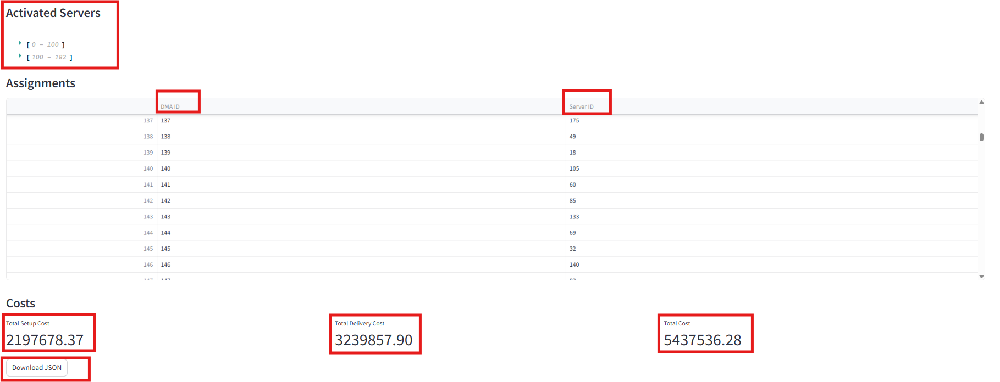
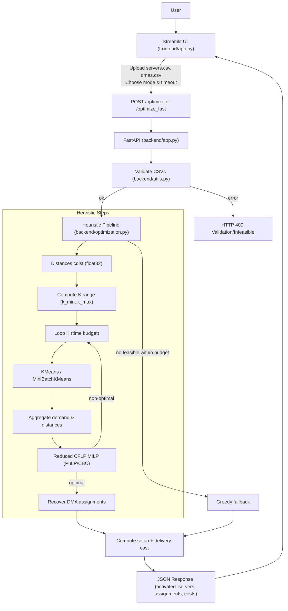

## Expected Deliverables Summary 

## Application Summary

### 1) Algorithm & Implementation

#### Problem Restatement
Given a set of potential ad‑pod stitching servers (each with setup cost and capacity) and a set of DMAs (each with location and demand), choose which servers to activate and assign each DMA to exactly one active server such that the sum of setup costs and delivery costs (modeled as Euclidean distance) is minimized, subject to capacity constraints.

#### Current Algorithm Used
The backend implements a CFLP‑Heuristic in `backend/optimization.py` combining:
- K‑means/MiniBatchKMeans clustering on DMA locations to reduce the problem dimension
- An exact MILP solve (PuLP + CBC) on the reduced instance (clusters vs servers)
- DMA‑level assignment recovery from cluster assignments
- Greedy fallback if no feasible MILP solution is found within the time budget

High‑level steps (in `run_cflp_heuristic`):
- Validate feasibility early: ensure total server capacity ≥ total DMA demand.
- Compute distance matrix `D ∈ R^{N_servers × N_dmas}` using `scipy.spatial.distance.cdist` as float32.
- Compute feasible K range via `compute_k_range(total_demand, max_capacity, num_dmas)` with:
  - `k_min = ceil(total_demand / max_server_capacity)` and `k_max = min(500, num_dmas)`.
- Sample up to 4 K values linearly from `[k_min, k_max]` subject to a global time budget (`OPTIMIZER_TIME_BUDGET_SECONDS`, default 30s):
  - Cluster DMAs (KMeans for smaller sizes; MiniBatchKMeans past `OPTIMIZER_MINIBATCH_THRESHOLD`, default 2000).
  - Aggregate per‑cluster demand and per‑server aggregated distance to the entire cluster (sum of raw DMA distances to the server).
  - Formulate a reduced CFLP MILP:
    - Variables: `y_j ∈ {0,1}` (open server j), `x_{j,k} ∈ {0,1}` (assign cluster k to server j)
    - Objective: minimize `Σ setup_cost_j*y_j + Σ aggregated_distance_{j,k}*x_{j,k}`
    - Constraints: each cluster assigned once; server capacity ≥ sum of its clusters’ demands; linking `x_{j,k} ≤ y_j`.
    - Solve with CBC under a per‑attempt time cap carved from the global budget.
  - If a finite/optimal solution is found: recover DMA assignments from cluster choices, compute exact costs, and track the best result. With `OPTIMIZER_EARLY_FEASIBLE=1` (default), return first feasible.
- If no feasible K works within the budget: run `run_greedy_heuristic` that assigns each DMA to the nearest server with sufficient remaining capacity.

Notes:
- Delivery cost is computed as the sum of raw distances (unweighted by demand). Capacity constraints incorporate demand quantities.
- All numeric work is vectorized with NumPy; distances float32 balance speed and memory.

#### Why this Algorithm
- Full exact CFLP at DMA granularity is typically too slow/large at scale; clustering drastically reduces problem size.
- Reduced MILP yields high‑quality decisions on “cluster representatives,” preserving capacity feasibility while allowing exact solving of an abstracted instance.
- The greedy fallback guarantees responsiveness and feasibility when MILP cannot converge within time limits.

#### Advantages
- Speed vs quality balance: clustering + reduced exact solve delivers near‑optimal solutions quickly.
- Scalability: handles thousands of servers and large DMA counts by controlling K and using MiniBatchKMeans.
- Robustness: early feasibility checks, time‑budgeting, and graceful fallback ensure an answer under tight SLAs.
- Determinism: fixed `random_state=42` provides reproducible clustering.

#### Disadvantages / Trade‑offs
- Optimality gap: the reduced problem (on clusters) may not capture fine‑grained structure; solution can deviate from global optimum.
- Delivery cost model: using unweighted raw distance (rather than demand‑weighted distance) in the objective makes capacity constraints carry all demand information; depending on business goals, a demand‑weighted delivery cost might be preferred.
- K sampling: using up to 4 K values favors responsiveness over deeper exploration; may miss better K values.
- Sensitivity: clustering outcomes depend on spatial distribution and chosen K.

#### Alternative Approaches (Considerations)
- Pure greedy/nearest‑feasible: fastest, but typically lower quality; used here as a safety net.
- Local search / metaheuristics (e.g., simulated annealing, tabu): can improve heuristic solutions but add tuning complexity and runtime.
- Full exact MILP on all DMAs: guarantees optimality but scales poorly in practice.
- Lagrangian relaxation / column generation: stronger optimization but higher implementation complexity.
- OR‑Tools CP‑SAT modeling: alternative solver backend; similar considerations on problem size and modeling choices.


### 2) The Final Solution 
      2.1) A list of which servers to activate: The Output is in optimization_result_json file in this Deliverable folder.
      2.2) The final assignment of each DMA to an activated server: The Output is in optimization_result_json file in this Deliverable folder.
      2.3) A cost breakdown: Total Setup Cost, Total Delivery Cost, and the final minimized Total Cost: The Output is in Output_Cost_breakdown Image file in this Deliverable folder.


### 3) Visualization

Objective: A single plot that shows all server locations (activated vs not activated), all DMAs, and lines connecting each DMA to its assigned server.

Recommended approach (Altair, see `frontend/visualisation.py` as baseline):
- Points: plot servers as larger red markers; DMAs as smaller blue markers.
- Edges: for each DMA, draw a line segment from DMA point to the coordinates of its assigned server.
- Layers: render edge lines beneath points for clarity.

Example implementation snippet (Altair):

```python
import pandas as pd
import altair as alt

def visualize_solution(servers_df: pd.DataFrame, dmas_df: pd.DataFrame, assignments: dict[str, str]) -> alt.Chart:
    # Join DMA rows with their assigned server coordinates
    dmas = dmas_df.copy()
    dmas["server_id"] = dmas["dma_id"].map(assignments)
    servers_coords = servers_df.set_index("server_id")[['location_x', 'location_y']]
    dmas = dmas.join(servers_coords, on="server_id", rsuffix="_server")

    # Build long-form segments (two points per DMA: DMA and its server)
    segments = []
    for _, row in dmas.iterrows():
        segments.append({
            "dma_id": row["dma_id"],
            "role": "dma",
            "x": float(row["location_x"]),
            "y": float(row["location_y"]),
        })
        segments.append({
            "dma_id": row["dma_id"],
            "role": "server",
            "x": float(row["location_x_server"]),
            "y": float(row["location_y_server"]),
        })
    segments_df = pd.DataFrame(segments)

    # Lines: one polyline per DMA (2 points)
    lines = (
        alt.Chart(segments_df)
        .mark_line(color="#BBBBBB")
        .encode(
            x="x:Q",
            y="y:Q",
            detail="dma_id:N",
            tooltip=["dma_id:N"],
        )
    )

    # Points: servers and DMAs
    servers_plot = (
        alt.Chart(servers_df)
        .mark_point(color="red", size=80)
        .encode(
            x="location_x:Q",
            y="location_y:Q",
            tooltip=["server_id:N", "capacity_streams:Q"],
        )
    )
    dmas_plot = (
        alt.Chart(dmas_df)
        .mark_point(color="blue", size=40)
        .encode(
            x="location_x:Q",
            y="location_y:Q",
            tooltip=["dma_id:N", "demand_streams:Q"],
        )
    )

    return (lines + servers_plot + dmas_plot).properties(width=700, height=500)
```

Tips:
- To distinguish activated servers, color or shape them differently. After solving, compute an `is_active` mask and map color/shape by that field for `servers_df`.
- For dense plots, consider alpha blending for lines and interactive pan/zoom.


### 4) Written Explanation: Methodology, Trade‑offs, Assumptions, Scalability

#### Methodology Summary
- Validate CSV inputs and feasibility (`backend.utils`).
- Compute distances and determine a small set of candidate K values.
- For each K, cluster DMAs and solve a reduced CFLP exactly under a time budget. Recover DMA assignments from cluster assignment and compute precise costs from the full distance matrix.
- If none succeed within the time budget, use a greedy assignment ensuring feasibility.

#### Why This Algorithm
- It preserves the core capacity structure and uses exact optimization where it is tractable (on clusters), while massively reducing problem size via clustering. This yields strong solutions with practical runtimes.

#### Trade‑offs
- Optimality vs speed: clustering sacrifices some optimality to reduce runtime; early feasible exit further prioritizes responsiveness.
- Exploration depth vs responsiveness: sampling only a few K values reduces search time but risks missing better K.
- Simplicity vs fidelity: the delivery cost is unweighted by demand; capacity constraints carry demand, which is simpler but may underweight congested routes in the objective.

#### Key Assumptions
- Euclidean distance is a reasonable proxy for delivery cost/latency.
- Capacities are hard constraints; all DMA demand must be served.
- Clustering by geography approximates real operational grouping.
- Using float32 for distances is sufficient for accuracy while saving memory.

#### Scalability to 1000 Servers and 50,000 DMAs
Viability: The approach remains viable with the following practices, already reflected in the implementation:
- Use `MiniBatchKMeans` for large DMA counts (default switch at 2000).
- Keep distances in float32 and reuse matrix efficiently.
- Enforce a global time budget and craft per‑solve MILP timeouts.

Potential Enhancements for very large scales (50k DMAs):
- Demand‑weighted clustering or capacity‑aware clustering to better shape cluster loads.
- Adaptive K selection (e.g., log‑space sampling; quick pilot solves to prune K values).
- On‑the‑fly or chunked distance computations when memory is tight.
- Replace the aggregated distance cost with demand‑weighted distances in the MILP objective if business value favors it.
- Use OR‑Tools CP‑SAT or advanced decomposition (e.g., Lagrangian relaxation) for the reduced problem to potentially improve robustness under tight time limits.
- Parallelize K attempts and solver runs when resources allow.


### 5) Application Architecture & Execution Flow

#### Architecture Overview
- Frontend: `Streamlit` app (`frontend/app.py`) for file upload, triggering optimization, and visualizing results.
- Backend: `FastAPI` (`backend/app.py`) exposing `/health`, `/optimize`, `/optimize_fast` with structured logging (`structlog`) and CORS for the frontend.
- Optimization Engine: `backend/optimization.py` containing CFLP‑Heuristic and greedy fallback; helpers in `backend/utils.py`; response models in `backend/models.py`.
- Deployment: containerized backend; Compose stack includes frontend service running Streamlit.

#### Execution Flow Diagram (Mermaid)



Key runtime configuration:
- `OPTIMIZER_TIME_BUDGET_SECONDS` (default 30)
- `OPTIMIZER_EARLY_FEASIBLE` (default 1)
- `OPTIMIZER_MINIBATCH_THRESHOLD` (default 2000)

Observability and resilience:
- Structured logs: request sizes, outcomes, and exceptions.
- Clear HTTP 400 for validation/infeasibility, HTTP 500 for unexpected errors.
- Frontend displays errors and results, with JSON download.


